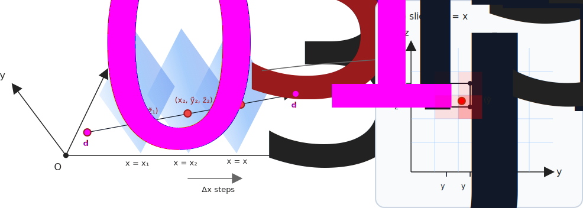

.. _theory_background:

Theory / background
===================

This page summarizes the core ideas behind the (TOF-weighted) line integrals implemented in
``libparallelproj``. The goal is to provide a compact reference for users of the library.

Notation
--------

We consider a continuous image/object :math:`f(\mathbf{r})` with :math:`\mathbf{r}=(x,y,z)` (3D) or
:math:`\mathbf{r}=(x,y)` (2D). A line of response (LOR) is defined by two detector points
:math:`\mathbf{p}_0` and :math:`\mathbf{p}_1`. Its length is :math:`L=\|\mathbf{p}_1-\mathbf{p}_0\|` and the
unit direction vector is :math:`\mathbf{u} = (\mathbf{p}_1-\mathbf{p}_0)/L`.

A convenient parameterization along the LOR is

.. math::

   \mathbf{r}(s) = \mathbf{p}_0 + s\,\mathbf{u},
   \qquad s \in [0, L].

Non-TOF line integral
---------------------

The (continuous) non-TOF projection value along the LOR is

.. math::

   p = \int_0^L f(\mathbf{r}(s)) \, ds.

In a voxelized image, this becomes a weighted sum over voxels, where the weights approximate the
path length contribution through each voxel and the voxel values are sampled/interpolated.

Joseph’s method in 3D
---------------------

Joseph’s method :cite:`Joseph1982`  approximates the line integral by sampling the ray on a sequence of planes
orthogonal to the dominant direction and interpolating in the transverse plane.

Without loss of generality, assume **x is the dominant direction**, i.e.

.. math::

   |u_x| \ge |u_y| \quad \text{and} \quad |u_x| \ge |u_z|.

Sampling planes
^^^^^^^^^^^^^^^

Let :math:`\{x_k\}_{k=1}^n` be the x-coordinates of the sampling planes, typically chosen as the
x-coordinates of voxel centers that lie between the entry and exit points of the ray through the
image bounding box.

For each plane :math:`x=x_k`, compute the corresponding ray parameter :math:`s_k`:

.. math::

   s_k = \frac{x_k - x_0}{u_x},

and then the continuous intersection point in y and z:

.. math::

   \tilde{y}_k = y_0 + s_k u_y, \qquad
   \tilde{z}_k = z_0 + s_k u_z.

These are the (continuous) transverse coordinates of the ray where it intersects the plane
:math:`x=x_k`.

With a constant step in x (the voxel size in x), the path-length increment is

.. math::

   \Delta s = \frac{\Delta_x}{|u_x|}.

Joseph’s method then approximates the line integral as

.. math::

   p \approx \sum_{k=1}^{n} f(x_k,\tilde{y}_k,\tilde{z}_k)\,\Delta s.

where :math:`(\tilde{y}_k,\tilde{z}_k)` are the continuous intersection coordinates and
:math:`f(x_k,\tilde{y}_k,\tilde{z}_k)` is evaluated via bilinear interpolation in :math:`(y,z)`.

TOF-weighted line integrals
---------------------------

Time-of-flight (TOF) information assigns a **weight along the LOR** depending on where the emission
is likely to have occurred. For a TOF bin centered at :math:`\tau` (time difference) one typically
models a Gaussian along the LOR coordinate :math:`s` (or an equivalent centered coordinate).

A convenient centered coordinate is :math:`t` measured along the LOR with :math:`t=0` at the LOR
midpoint:

.. math::

   t = s - \frac{L}{2},
   \qquad t \in \left[-\frac{L}{2}, \frac{L}{2}\right].

Gaussian TOF kernel (continuous)
^^^^^^^^^^^^^^^^^^^^^^^^^^^^^^^^

Let :math:`\sigma_t` be the TOF standard deviation *in distance units along the LOR* (often derived
from the system CTR). The ideal (continuous) Gaussian kernel centered at :math:`t_c` is

.. math::

   g(t; t_c, \sigma_t)
   = \frac{1}{\sqrt{2\pi}\sigma_t}\exp\!\left(-\frac{(t-t_c)^2}{2\sigma_t^2}\right).

The corresponding TOF-weighted line integral is

.. math::

   p_{\text{TOF}}(t_c)
   = \int_0^L f(\mathbf{r}(s))\; g\!\left(s-\frac{L}{2};\, t_c, \sigma_t\right)\, ds.

Finite TOF bin width and the *effective* TOF kernel
^^^^^^^^^^^^^^^^^^^^^^^^^^^^^^^^^^^^^^^^^^^^^^^^^^^^

In practice, TOF data are binned. A bin has a finite width :math:`\Delta` (in distance units along
the LOR, after converting from time), and one typically wants the probability mass **integrated over
the bin**.

If a bin is centered at :math:`t_c` and spans :math:`[t_c-\Delta/2,\, t_c+\Delta/2]`, then an
effective (binned) kernel can be defined as the Gaussian convolved with a rectangular window, or
equivalently as the Gaussian **integrated over the bin limits**.

A common and very useful closed form is the bin probability for a point at coordinate :math:`t`:

.. math::

   w_{\text{eff}}(t; t_c, \sigma_t, \Delta)
   = \int_{t_c-\Delta/2}^{t_c+\Delta/2} g(t; \xi, \sigma_t)\, d\xi
   = \frac{1}{2}\left[
       \operatorname{erf}\!\left(\frac{t - (t_c-\Delta/2)}{\sqrt{2}\sigma_t}\right)
       - \operatorname{erf}\!\left(\frac{t - (t_c+\Delta/2)}{\sqrt{2}\sigma_t}\right)
     \right].

This :math:`w_{\text{eff}}` is dimensionless and represents the fraction of the Gaussian mass that
falls into the TOF bin.

With Joseph sampling points :math:`t_k` along the LOR, the TOF projection is approximated as

.. math::

   p_{\text{TOF}}(t_c)
   \approx \sum_k f(\mathbf{r}(s_k))\; w_{\text{eff}}(t_k; t_c, \sigma_t, \Delta)\; \Delta s.

TOF projections: sinogram vs listmode
-------------------------------------

Although the underlying physics is the same, TOF projection/backprojection differs slightly in how
measurements are indexed and accumulated.

TOF sinogram
^^^^^^^^^^^^

A TOF sinogram stores counts in discrete bins:

- geometric bin (e.g. segment/view/tangential/axial indices, depending on scanner geometry and
  sinogram definition),
- TOF bin index :math:`b` (centered at :math:`t_{c,b}` with width :math:`\Delta`).

Forward projection for a TOF sinogram produces *one value per (LOR bin, TOF bin)*:

.. math::

   p_{j,b} \approx \sum_k f(\mathbf{r}_{j}(s_k))\; w_{\text{eff}}(t_{j,k}; t_{c,b}, \sigma_t, \Delta)\; \Delta s,

where :math:`j` indexes the sinogram LOR bin.

Backprojection distributes each sinogram residual :math:`r_{j,b}` along LOR :math:`j` weighted by
the same :math:`w_{\text{eff}}` for bin :math:`b`.

TOF listmode
^^^^^^^^^^^^

Listmode stores events individually. Each event typically carries:

- the LOR identity (detector pair, or equivalent),
- a measured TOF value mapped to a TOF bin :math:`b_i` or to a continuous estimate :math:`t_i`
  (implementation-dependent).

For TOF listmode, forward projection produces *one value per event* (or per event TOF bin),
i.e. you evaluate the same TOF-weighted integral using the event's LOR and its TOF center:

.. math::

   p_i \approx \sum_k f(\mathbf{r}_{i}(s_k))\; w_{\text{eff}}(t_{i,k}; t_{c,i}, \sigma_t, \Delta)\; \Delta s.

Listmode is often convenient for:
- sparse data and event-wise likelihood models,
- avoiding explicit histogramming into sinograms,
- supporting event-dependent metadata (e.g. per-event TOF center).

Truncation of the effective Gaussian TOF kernel
-----------------------------------------------

The Gaussian (and thus :math:`w_{\text{eff}}`) has infinite support, but in practice its tails
contribute negligibly far from the center and are expensive to evaluate.

A standard approach is to truncate the kernel beyond a configurable number of standard deviations
``num_sigmas``:

.. math::

   |t - t_c| > n_\sigma \,\sigma_t \quad \Longrightarrow \quad w_{\text{eff}}(t; t_c, \sigma_t, \Delta) \approx 0.

Implementation-wise, this means, for each TOF bin center :math:`t_c`, only ray samples with :math:`t_k` in

.. math::

   \left[t_c - n_\sigma \,\sigma_t,\; t_c + n_\sigma\,\sigma_t\right]

are considered.

Samples outside this window are ignored (weight set to zero) which reduces computation substantially.
The truncated weights are renormalized to ensure that the sum over the TOF bins of a TOF projection is the
same as the non-TOF projection.

Choosing ``num_sigmas``
^^^^^^^^^^^^^^^^^^^^^^^

The default values (3) already capture most of the Gaussian mass. The trade-off is:

- larger ``num_sigmas``: more accurate tail contributions, more compute
- smaller ``num_sigmas``: faster, slightly more approximation error
