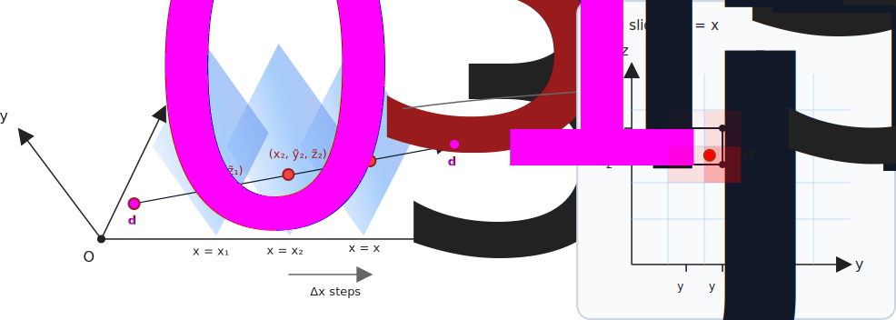
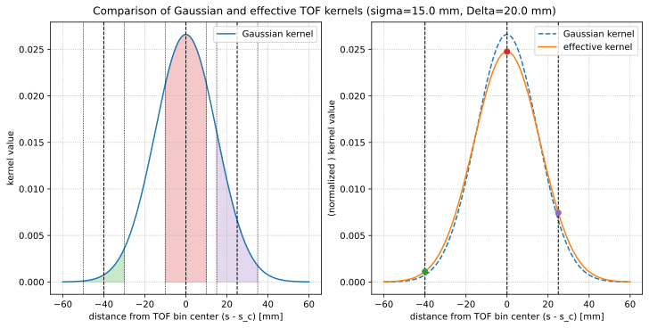

.. _theory_background:

Theory and background
=====================

This page summarizes the core ideas behind the (TOF-weighted) line integrals implemented in
``libparallelproj``. The goal is to provide a compact reference for users of the library.

Line integrals (in 3D)
----------------------

We consider a continuous image/object :math:`f(\mathbf{r})` with :math:`\mathbf{r}=(x,y,z)` (3D) or
:math:`\mathbf{r}=(x,y)` (2D). A line of response (LOR) is defined by two detector points
:math:`\mathbf{d}_0` and :math:`\mathbf{d}_1`. Its length is :math:`L=\|\mathbf{d}_1-\mathbf{d}_0\|` and the
unit direction vector is :math:`\mathbf{u} = (\mathbf{d}_1-\mathbf{d}_0)/L`.

A convenient parameterization along the LOR is

.. math::

   \mathbf{r}(s) = \mathbf{d}_0 + s\,\mathbf{u},
   \qquad s \in [0, L].

The (continuous) non-TOF projection value along the LOR is

.. math::

   p = \int_0^L f(\mathbf{r}(s)) \, ds.

In a voxelized image, this becomes a weighted sum over voxels, where the weights approximate the
path length contribution through each voxel and the voxel values are sampled/interpolated.

Joseph’s method
---------------

Joseph’s method :cite:`Joseph1982`  approximates the line integral by sampling the ray on a sequence of planes
orthogonal to the dominant direction and interpolating in the transverse plane.

Without loss of generality, assume **x is the dominant direction**, i.e.

.. math::

   |u_x| \ge |u_y| \quad \text{and} \quad |u_x| \ge |u_z|.

Sampling planes
^^^^^^^^^^^^^^^

Let :math:`\{x_k\}_{k=1}^n` be the x-coordinates of the sampling planes, typically chosen as the
x-coordinates of voxel centers that lie between the entry and exit points of the ray through the
image bounding box.

For each plane :math:`x=x_k`, compute the corresponding ray parameter :math:`s_k`:

.. math::

   s_k = \frac{x_k - x_0}{u_x},

and then the continuous intersection point in y and z:

.. math::

   \tilde{y}_k = y_0 + s_k u_y, \qquad
   \tilde{z}_k = z_0 + s_k u_z.

These are the (continuous) transverse coordinates of the ray where it intersects the plane
:math:`x=x_k`.

With a constant step in x (the voxel size in x), the path-length increment is

.. math::

   \Delta s = \frac{\Delta_x}{|u_x|}.

Joseph’s method then approximates the line integral as

.. math::

   p \approx \sum_{k=1}^{n} f(x_k,\tilde{y}_k,\tilde{z}_k)\,\Delta s.

where :math:`(\tilde{y}_k,\tilde{z}_k)` are the continuous intersection coordinates and
:math:`f(x_k,\tilde{y}_k,\tilde{z}_k)` is evaluated via bilinear interpolation in :math:`(y,z)`.

TOF-weighted line integrals
---------------------------

Time-of-flight (TOF) information assigns a **weight along the LOR** depending on where the emission
is likely to have occurred.
Typically this can be modeled as a Gaussian along the LOR coordinate :math:`s`
(or an equivalent centered coordinate).

.. note::
  1. The conincidence time resolution (CTR) of PET scanners is often specified in time units (e.g. ps), but it can be converted to distance units along the LOR by multiplying with :math:`c/2` (where :math:`c` is the speed of light).

  2. Knowing that :math:`c` is approximately 0.3 mm/ps, a :math:`\sigma` of 100 ps corresponds to 15 mm along the LOR.

  3. The CTR of PET scanners is often specified as a full-width at half maximum (FWHM) value, which can be converted to :math:`\sigma` via :math:`\sigma = \text{FWHM} / (2\sqrt{2\ln(2)}) \approx \text{FWHM} / 2.355`.

Continuous Gaussian TOF kernel
^^^^^^^^^^^^^^^^^^^^^^^^^^^^^^

Let :math:`\sigma_\text{TOF}` be the TOF standard deviation *in distance units along the LOR* (often derived
from the system CTR). The ideal (continuous) Gaussian kernel centered at :math:`s_c` is

.. math::

   g(s; s_c, \sigma_\text{TOF})
   = \frac{1}{\sqrt{2\pi}\sigma_\text{TOF}}\exp\!\left(-\frac{(s-s_c)^2}{2\sigma_\text{TOF}^2}\right).

The corresponding TOF-weighted line integral is

.. math::

   p_{\text{TOF}}(s_c, \sigma_\text{TOF})
   = \int_0^L f(\mathbf{r}(s))\; g\!\left(s;\, s_c, \sigma_\text{TOF}\right)\, ds.

Finite TOF bin width and the effective TOF kernel
^^^^^^^^^^^^^^^^^^^^^^^^^^^^^^^^^^^^^^^^^^^^^^^^^

In practice, TOF data are binned (due to the use of TDCs)- which is equivalent to subdividing the LOR into discrete segments.
A TOF bin has a finite width :math:`\Delta` (in distance units along
the LOR, after converting from time), and one typically wants the probability mass **integrated over
the bin**.

If a bin is centered at :math:`s_c` spans :math:`[s_c-\Delta/2,\, s_c+\Delta/2]`, then an
effective (binned) kernel can be defined as the Gaussian convolved with a rectangular window, or
equivalently as the Gaussian **integrated over the bin limits**.

For a continuous Gaussian kernel, this results in an effective TOF kernel of the form

.. math::

   w_{\text{eff}}(s; s_c, \sigma_\text{TOF}, \Delta)
   = \int_{s_c-\Delta/2}^{s_c+\Delta/2} g(\xi; s_c, \sigma_\text{TOF})\, d\xi
   = \frac{1}{2}\left[
       \operatorname{erf}\!\left(\frac{s - (s_c-\Delta/2)}{\sqrt{2}\sigma_\text{TOF}}\right)
       - \operatorname{erf}\!\left(\frac{s - (s_c+\Delta/2)}{\sqrt{2}\sigma_\text{TOF}}\right)
     \right].

This :math:`w_{\text{eff}}` is dimensionless and represents the fraction of the Gaussian mass that
falls into the TOF bin.

With Joseph sampling points :math:`s_k` along the LOR, the TOF projection for a given LOR and TOF bin center :math:`s_c` is approximated as

.. math::

   p_{\text{TOF}}(s_c)
   \approx \sum_k f(\mathbf{r}(s_k))\; w_{\text{eff}}(s_k; s_c, \sigma_\text{TOF}, \Delta)\; \Delta s.

.. note::
  If the continous kernel is non-Gaussian, the effective kernel can be defined similarly by integrating the continous kernel over the TOF bin limits.

TOF projections: sinogram vs listmode
-------------------------------------

Although the underlying physics is the same, the evaluation of TOF projections
is implemented differently for TOF sinogram and TOF listmode data, to increase efficiency.

TOF sinogram
^^^^^^^^^^^^

When dealing with TOF sinograms, we are typically interested in computing projections / backprojections
for all TOF bins of a given LOR,
which allows for efficient reuse of the ray samples when
stepping through the planes in the dominant direction.

For a given interpolated image values along the ray :math:`f(\mathbf{r}(s_k))`,
we evaluate the effective TOF weights for "all" TOF bins.

TOF listmode
^^^^^^^^^^^^

When operating in listmode (event-by-event reconstruction), we are typically only interested
in the projection value for a certain single TOF bin for a given LOR (the TOF bin of a given event, detected on a given LOR).

In this case, we only evaluate the effective TOF weights for the relevant TOF bin center :math:`t_c` and ignore the others.

Moreover, based on the width of the (effective) TOF kernel, we can further ignore ray samples that are far from the TOF bin center,
which leads to a significant speedup (see next section).

Truncation of the effective Gaussian TOF kernel
-----------------------------------------------

The continuous Gaussian as well as the effective TOF kernel (:math:`w_{\text{eff}}`) has infinite support,
but in practice its tails contribute negligibly far from the center and are expensive to evaluate.

A standard approach is to truncate the kernel beyond a configurable number of standard deviations :math:`n_\sigma`:

.. math::

   |s - s_c| > n_\sigma \,\sigma_\text{TOF} \quad \Longrightarrow \quad w_{\text{eff}}(s; s_c, \sigma_\text{TOF}, \Delta) \approx 0.

Implementation-wise, this means that

1. in sinogram mode, at a given ray sample :math:`s_k`, we only evaluate the effective TOF weights for TOF bins whose centers are within
:math:`n_\sigma \sigma_\text{TOF}` of :math:`s_k`.

2. in listmode, we only evaluate the effective TOF weights for ray samples :math:`s_k` that are within :math:`n_\sigma \sigma_\text{TOF}` of the TOF bin center :math:`s_c`.

.. important::

  1. The choice of :math:`n_\sigma` is a trade-off between accuracy and speed. A smaller :math:`n_\sigma` leads to faster computations but may introduce bias if the kernel tails are not negligible. This means that :math:`n_\sigma` should be chosen large enough to capture the majority of the kernel mass, otherwise the truncation may introduce bias in the projections. The default value of :math:`n_\sigma=3` which is typically sufficient for most applications.

  2. We always **re-normalize** the effective TOF kernel **after truncation** to ensure that the integral over the truncated kernel is the same as the integral over the full kernel. In case :math:`n_\sigma` is too small (e.g. < 3) significant kernel mass is truncated and the re-normalization introduces bias in the shape of the effective TOF kernel (on top of the truncation).

Math symbols vs C API variable names
------------------------------------

.. csv-table::
   :header: "Symbol in theory/background", "Meaning", "API variable name"
   :widths: 30, 35, 35

   ":math:`\mathbf{d}_0`", "LOR start point", "``lor_start``"
   ":math:`\mathbf{d}_1`", "LOR end point", "``lor_end``"
   ":math:`f(\mathbf{r})`", "(discretized) image", "``image``"
   ":math:`\Delta`", "TOF bin width", "``tof_bin_width``"
   ":math:`\sigma_{\mathrm{TOF}}`", "TOF standard deviation", "``tof_sigma``"
   ":math:`n_\sigma`", "Truncation width in units of :math:`\sigma_{\mathrm{TOF}}`", "``num_sigmas``"
